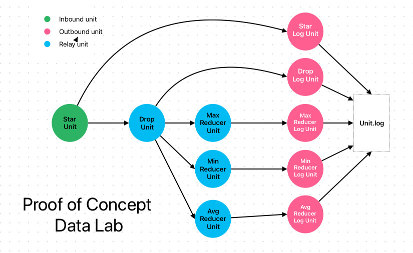

# README

Unit based data lab. Proof of Concept of ALOHA Protocol. Requires python 3.11. 



Tha lab is built with 10 units. 

* 1 inbound unit.
* 4 relay units. 
* 5 outbound units.

Data flows from star unit until the unit.log file.

## Install

```
$ pip install .
```


## Run development environment

```
# Install dev package
$ pip install -e .

# Start the data flowing through the lab
$ ./run.sh

# Stop all processes
$ ./stop.sh
```

## Testing

```
# Install hatch
$ pip install hatch

# run tests
$ hatch test